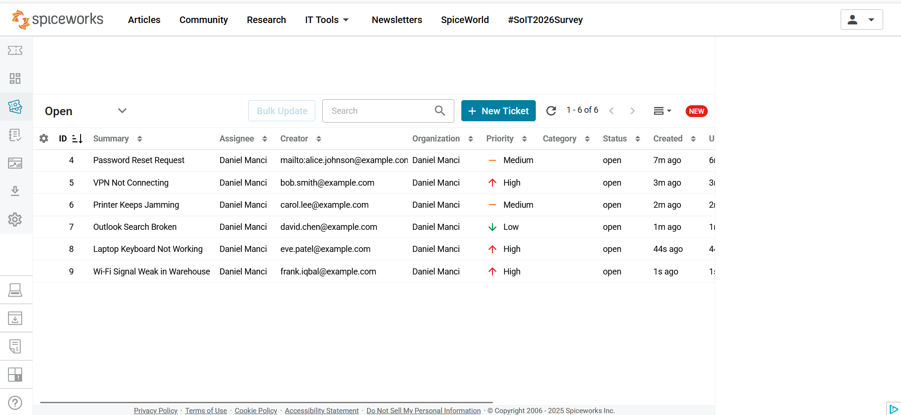
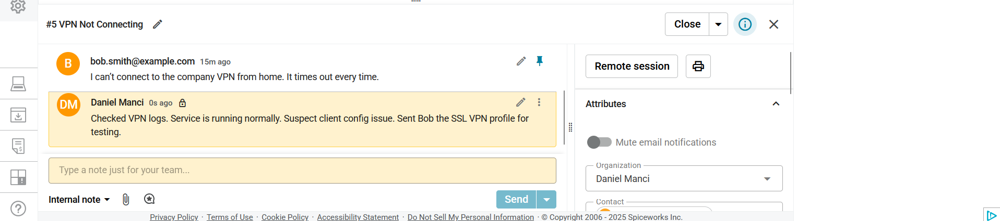
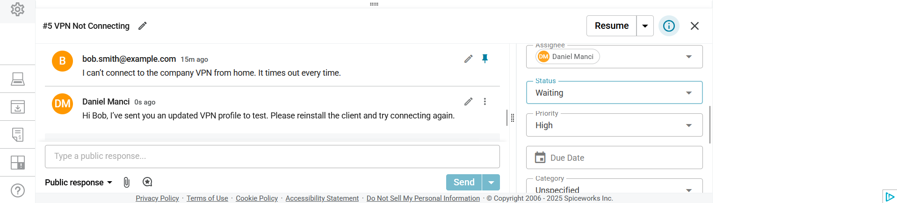
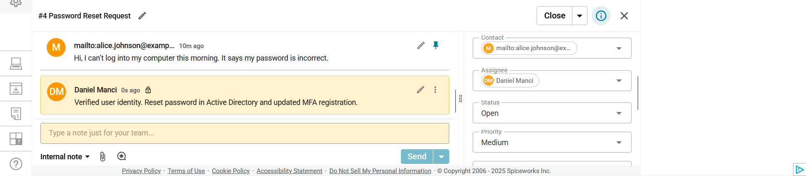
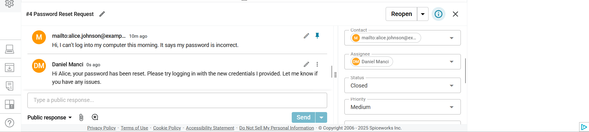
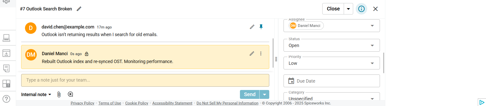
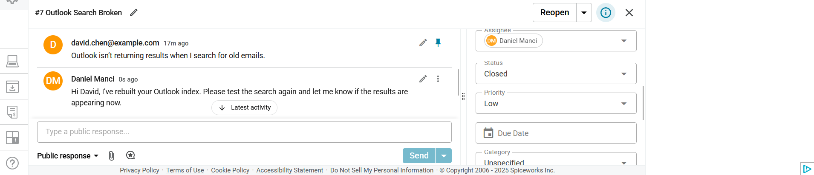

# IT Support Ticketing Simulation

Hands-on practice with **IT Support Ticketing** using the Spiceworks Cloud Help Desk platform.  
Simulated real-world IT workflows: logging issues, prioritising tickets, documenting troubleshooting, and closing tickets with user communication.

---

## Ticket Handling Workflow
- Users raise tickets (e.g. password reset, VPN not connecting).  
- Tickets are prioritised (High, Medium, Low).  
- Internal notes are added for technical troubleshooting.  
- Public responses are shared with users.  
- Statuses updated (Open → Waiting → Closed).  

---

## Ticket Examples

### Ticket List (Overview)
Shows tickets of varying priority and status.  

### High Priority – VPN Not Connecting
- **Internal Note:** Checked VPN logs, suspected client config issue.  
- **Public Response:** Sent updated VPN profile to user.  
- **Status:** Waiting on user response.  
  

### Medium Priority – Password Reset
- **Internal Note:** Verified user identity, reset password in Active Directory.  
- **Public Response:** Informed user new credentials are ready.  
- **Status:** Closed.  
  

### Low Priority – Outlook Search Broken
- **Internal Note:** Rebuilt Outlook index and re-synced mailbox.  
- **Public Response:** Asked user to test search again.  
- **Status:** Closed.  
  

---

## Skills Demonstrated
- Logging and triaging IT support tickets.  
- Prioritisation of high, medium, and low impact issues.  
- Documenting internal troubleshooting steps.  
- Clear user-facing communication.  
- Managing ticket lifecycle: Open → Waiting → Closed.  
