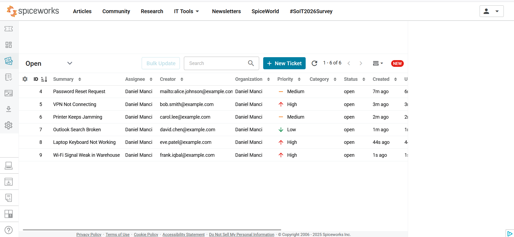
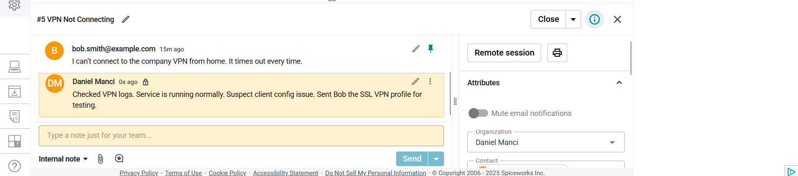
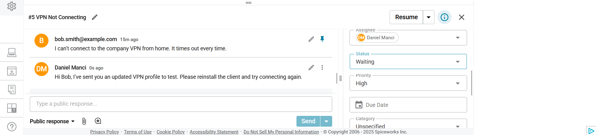
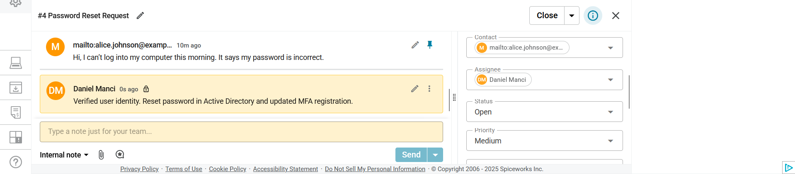
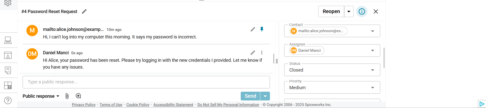
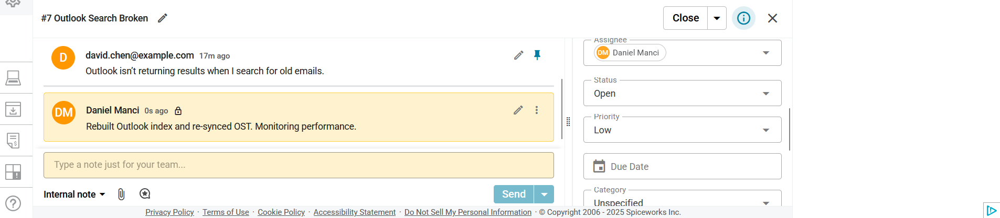
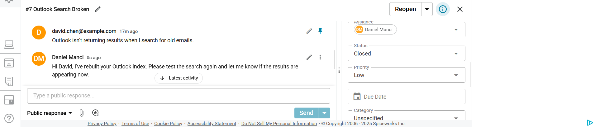

# IT Support Ticketing Simulation

A practical IT support lab demonstrating first-line service desk ticket handling using Spiceworks Cloud Help Desk.

The project simulates a small help desk environment where support requests are logged, prioritised, documented, updated and progressed through different ticket statuses.

The focus of this lab was on service desk workflow, ticket documentation, prioritisation and clear communication with users rather than reproducing every underlying technical fix.

## Lab Objectives

The objectives of this project were to practise:

- Logging IT support incidents
- Reviewing user-reported issues
- Assigning appropriate ticket priorities
- Recording internal troubleshooting notes
- Writing clear user-facing responses
- Updating ticket statuses
- Managing tickets through a support lifecycle
- Distinguishing between technician notes and customer communication
- Documenting simulated troubleshooting and resolution steps
- Developing practical first-line service desk skills

## Environment

- Spiceworks Cloud Help Desk
- Simulated end-user support requests
- First-line IT support workflow
- Internal technician notes
- Public user responses
- Ticket priority and status management

---

## Ticket Handling Workflow

The simulated support process followed a structured ticket lifecycle:

1. User reports an IT issue
2. Support request is logged in the ticketing system
3. Ticket impact and urgency are reviewed
4. Priority is assigned
5. Initial investigation is documented using internal notes
6. The user is updated through a public response
7. Ticket status is changed where appropriate
8. Further user confirmation is requested if required
9. Ticket is closed once the simulated issue is considered resolved

The lab used different priorities and statuses to represent how a service desk can organise multiple support requests.

### Ticket Overview

The ticket queue contained several simulated incidents with different priorities and statuses.

This provided practice in reviewing several support requests and identifying which incidents should receive attention first.

---

# Ticket 1: VPN Not Connecting

## User Issue

A simulated user reported that they were unable to connect to the organisation's VPN.

The incident was treated as **High Priority** because loss of remote connectivity could prevent a user from accessing systems required for work.

## Internal Technician Note

An internal note was added to record the simulated investigation.

The note documented that VPN logs had been reviewed and that a client configuration issue was suspected.

Internal notes are useful because they allow support staff to record technical information without exposing unnecessary troubleshooting detail to the user.

## User Communication

A separate public response was used to update the simulated user.

The ticket scenario documented that an updated VPN profile had been provided and asked the user to test the connection again.

The ticket was moved to a waiting state while confirmation from the user was pending.

## Ticket Outcome

- **Priority:** High
- **Issue:** VPN connectivity
- **Internal action:** Simulated investigation documented
- **User action required:** Test the updated connection configuration
- **Status:** Waiting for user response

## Support Skills Demonstrated

This scenario demonstrated:

- Prioritising a potentially business-impacting incident
- Recording technician-only investigation notes
- Communicating next steps clearly to a user
- Using a waiting status when user confirmation is required
- Maintaining a clear history of activity within the ticket

---

# Ticket 2: Password Reset

## User Issue

A simulated user required assistance accessing their account and a password reset was recorded as the proposed support action.

The ticket was assigned **Medium Priority**.

## Internal Technician Note

The internal ticket note documented the simulated support process, including user verification and a password-reset action.

This ticket was created to practise documenting an identity and access support request inside a help desk system.

The Active Directory password-reset action described in this ticket was part of the simulated ticket scenario and was not technically reproduced as part of this specific Spiceworks project.

## User Communication

A public response was added to inform the simulated user that the account-access action had been completed and that they could continue with the next login step.

The ticket was then moved to a closed state as part of the simulated workflow.

## Ticket Outcome

- **Priority:** Medium
- **Issue:** Account access / password reset
- **Internal action:** Simulated password-reset workflow documented
- **User communication:** User informed of the next step
- **Status:** Closed

## Support Skills Demonstrated

This scenario demonstrated:

- Recording an account-access request
- Documenting a simulated identity-verification process
- Keeping technical information in internal notes
- Providing a clear user-facing response
- Progressing a ticket through to closure

---

# Ticket 3: Outlook Search Not Working

## User Issue

A simulated user reported that Outlook search was not functioning correctly.

The incident was assigned **Low Priority** because the issue affected functionality but did not completely prevent the user from accessing email.

## Internal Technician Note

The internal note recorded a simulated troubleshooting approach involving Outlook indexing and mailbox synchronisation.

The Outlook repair actions described in the ticket were simulated support notes used to practise service desk documentation and were not technically reproduced as part of this Spiceworks project.

## User Communication

A public response was created asking the simulated user to test Outlook search again after the documented troubleshooting steps.

This demonstrated the importance of confirming functionality with the user rather than assuming that an issue is resolved immediately after a technical action.

## Ticket Outcome

- **Priority:** Low
- **Issue:** Outlook search functionality
- **Internal action:** Simulated troubleshooting documented
- **User action:** Test Outlook search again
- **Status:** Closed within the simulated workflow

## Support Skills Demonstrated

This scenario demonstrated:

- Prioritising a lower-impact software issue
- Recording troubleshooting information clearly
- Separating internal technical notes from public communication
- Asking the user to verify functionality
- Documenting the final ticket state

---

## Internal Notes vs Public Responses

One of the main objectives of the project was to practise the difference between technician documentation and user communication.

### Internal Notes

Internal notes were used to record information such as:

- Suspected causes
- Troubleshooting activity
- Technical observations
- Proposed support actions
- Information useful to another technician

These notes are intended for support staff rather than end users.

### Public Responses

Public responses were written using clearer user-facing language.

They were used to:

- Explain what action had been taken
- Tell the user what to do next
- Request testing or confirmation
- Provide progress updates
- Confirm closure where appropriate

This distinction helps maintain useful technical records while keeping communication understandable for non-technical users.

---

## Ticket Prioritisation

The lab used three priority levels:

### High Priority

Used for an issue with greater potential impact, such as loss of VPN connectivity.

### Medium Priority

Used for an issue requiring support but with less immediate operational impact, such as an individual password-reset request.

### Low Priority

Used for reduced functionality where the user could still perform most work, such as Outlook search not working correctly.

The purpose was to practise considering impact and urgency rather than treating every support request as equally critical.

---

## Ticket Status Management

Different ticket statuses were used to represent the support lifecycle.

### Open

The issue has been logged and requires investigation or action.

### Waiting

Support has taken an action and requires information or confirmation from the user before progressing further.

### Closed

The simulated support process has been completed and no further action is currently required.

Using clear statuses helps technicians track outstanding work and understand which tickets require attention.

---

## Service Desk Workflow Demonstrated

The overall workflow practised in this project was:

1. Review the user's reported problem
2. Record the incident in Spiceworks
3. Assess the issue's impact and urgency
4. Assign an appropriate priority
5. Add internal technical notes
6. Record simulated troubleshooting or support actions
7. Communicate clearly with the user
8. Update the ticket status
9. Request user verification where required
10. Close the ticket when the simulated support process is complete

---

## Skills Demonstrated

- Spiceworks Cloud Help Desk
- IT service desk workflow
- First-line IT support principles
- Ticket logging
- Incident categorisation
- Ticket prioritisation
- Impact and urgency assessment
- Internal technician documentation
- User-facing support communication
- Ticket status management
- Incident lifecycle management
- Managing Open, Waiting and Closed tickets
- Recording troubleshooting information
- Documenting proposed support actions
- Requesting user verification
- Clear communication with non-technical users
- Structured issue management
- Attention to detail
- Technical documentation

## Key Learning Outcomes

Through this project I developed practical experience in:

- Using a cloud-based help desk platform
- Understanding how IT support requests are recorded and managed
- Prioritising incidents based on their potential impact
- Separating technical notes from user-facing communication
- Maintaining a clear record of troubleshooting activity
- Updating users throughout a support process
- Using ticket statuses to track outstanding work
- Understanding when a ticket should remain waiting for user confirmation
- Documenting simulated resolutions and closure
- Understanding how structured ticket management supports a first-line IT service desk

## Relationship to Other Portfolio Projects

This project focuses specifically on the **service desk and ticket-management side of IT support**.

Other repositories in this portfolio provide technical evidence of troubleshooting and administration tasks, including:

- Windows endpoint troubleshooting
- Active Directory administration
- Microsoft Entra ID user and authentication support
- Microsoft Quick Assist remote troubleshooting
- PowerShell diagnostic information collection

Together, these projects demonstrate both the ticket-handling workflow and the practical technical investigation that can sit behind first-line IT support incidents.

## Project Context

This project was completed as a controlled IT support simulation using Spiceworks Cloud Help Desk.

The users, incidents, priorities, troubleshooting notes and responses shown in the repository were created specifically for the lab.

The technical actions described inside individual ticket notes were used to simulate realistic service desk documentation and do not necessarily represent technical actions performed within this specific project.

The purpose of the project was to practise ticket logging, prioritisation, technician documentation, user communication and ticket lifecycle management.

All screenshots shown in this repository were generated during the lab exercise.
